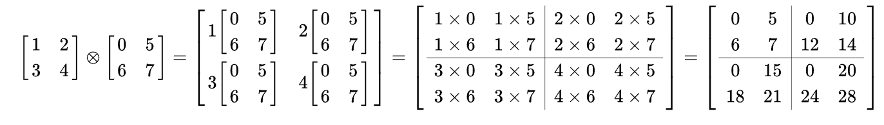

## Quantum Mechanics for Machine Learning and Neural Network Math Base for Lower Limb Exoskeleton

### Objective

- **Quantum Mechanics for Machine Learning:**  
  This topic focuses on understanding the fundamentals of `quantum computing`, including - how `qubits` are represented and manipulated using mathematical foundations such as vectors and probability theory. 
  
    => The goal is to build a simple project that demonstrates how `quantum mechanics` concepts can be applied in `machine learning` without relying on `built-in functions`, helping to develop an intuitive understanding of how quantum systems work.  
    - In this Quantum Mechanics, we will get use with `Kronecker product` whereas:
    
        ### Why Quantum Computing Uses Kronecker Product Instead of Normal Matrix Multiplication

        Quantum computation uses **qubits** instead of classical bits. Unlike classical bits that can only be `0` or `1`, a qubit can exist in a **superposition** of both states:

        $$
        |\psi\rangle = \alpha |0\rangle + \beta |1\rangle
        $$

        where:

        - $\alpha, \beta \in \mathbb{C}$ are complex probability amplitudes  
        - $|\alpha|^2 + |\beta|^2 = 1$

        This means even a single qubit exists in a **2-dimensional vector space**.

        ---

        ### Why Normal Matrix Multiplication Is Not Enough

        When we combine multiple qubits, we must represent **all possible combinations of their states**.

        For example, a 2-qubit system must represent:

        $$
        |00\rangle,\ |01\rangle,\ |10\rangle,\ |11\rangle
        $$

        This corresponds to a **4-dimensional space**.

        Normal matrix multiplication only transforms vectors **within the same space** and cannot increase dimensionality. However, quantum systems require the space to grow **exponentially** when qubits are combined.

        ---

        ### Tensor (Kronecker) Product

        To correctly combine quantum systems, we use the **Kronecker product**, also known as the tensor product.

        $$
        |\psi_{total}\rangle = |\psi_1\rangle \otimes |\psi_2\rangle
        $$

        This operation creates a new vector that represents the full joint quantum system.

        ---

        ## Dimension Growth

        | Number of Qubits | State Dimension |
        |------------------|-----------------|
        | 1 | 2 |
        | 2 | 4 |
        | 3 | 8 |
        | n | \(2^n\) |

        This exponential growth is one of the reasons quantum computing is powerful.

        ---

        ## Example 1 — Combining Basis States

        Single qubit state:

        $$
        |0\rangle =
        \begin{bmatrix}
        1\\
        0
        \end{bmatrix}
        $$

        Two qubits:

        $$
        |00\rangle = |0\rangle \otimes |0\rangle
        $$

        MATLAB example:

        ```matlab
        kron([1;0],[1;0])
- **Neural Network in Lower Limb Exoskeleton:**  
  This topic focuses on understanding `mathbase` of neural network foundation and it varitations including `type 2` and `fuzzy` for the Lower Limb Exoskeleton dataset.  
  
    => The goal is to build a predicted action from the input of users to guess what is the next action (the subjects we focus on both `male` and `female` - no age limit)
